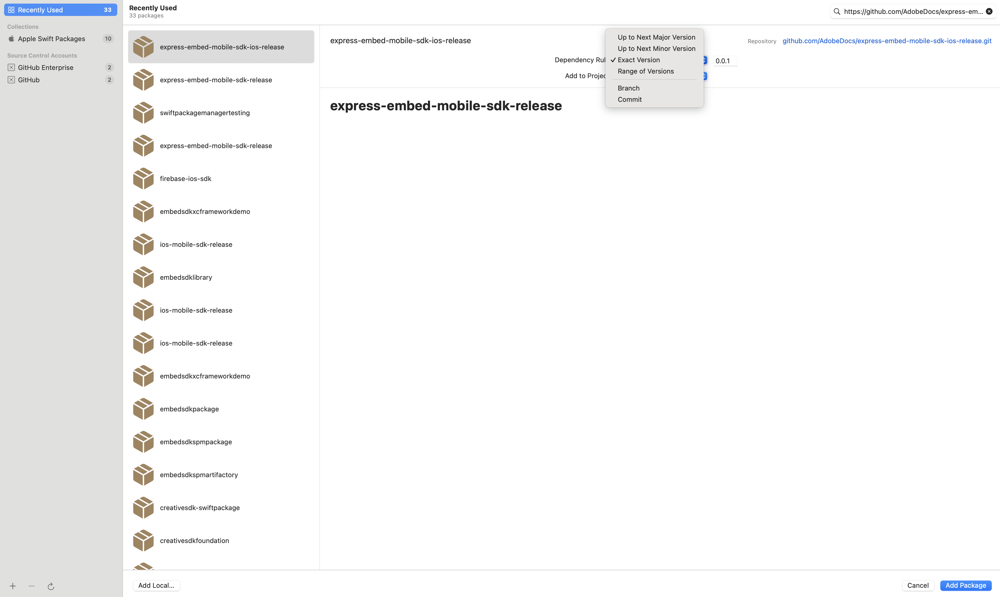

# Adobe Express Embed SDK – iOS

Repository to distribute SPM based integration. This repository provides the Embed iOS SDK, which enables integrating Adobe Express capabilities into third-party apps. The following section outlines the integration steps for third-party partners.

---

## Integration Guide

### Adding the SDK via Swift Package Manager (SPM)

1. In Xcode, go to:
2. File > Add Packages…
3. Enter the Git repository URL for this SDK:

```bash
https://github.com/AdobeDocs/express-embed-mobile-sdk-ios-release.git
```

4. Select the version rule you want to use (e.g., Exact Version, Up to Next Major, or Branch).




5. Click Add Package.
6. Choose the target(s) where you want to add the SDK and confirm.

## Releases

New versions of the SDK are published as **Git tags** in this repository.  
You can find the latest and previous releases on the [Releases page](https://github.com/AdobeDocs/express-embed-mobile-sdk-ios-release/releases).

When adding the SDK via Swift Package Manager (SPM), you can select a specific version tag.  
Updating to a newer release is as simple as updating the package dependency in Xcode to the desired version.

## API Documentation

For detailed information about available classes, methods, callbacks, and configuration options, please refer to the 👉 [**API Reference**](./docs/index.md).
